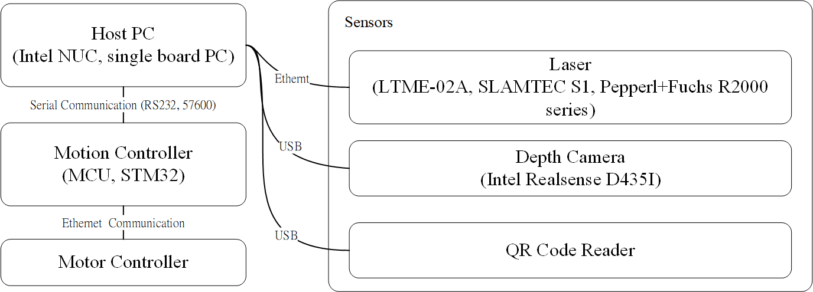
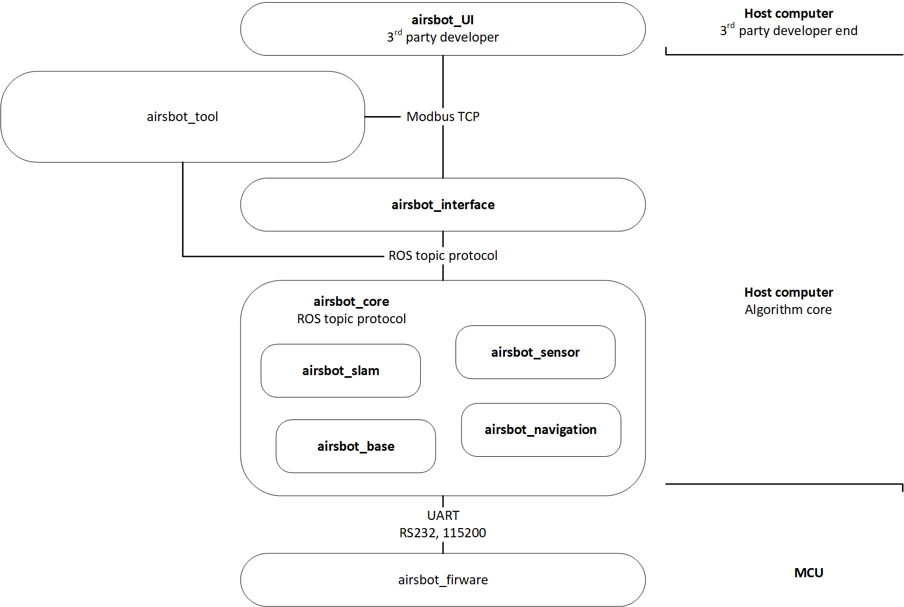

# Airsbot

This is the repo of airsbot which is an AGV of two versions, which are the **indoor** version and the **outdoor** version. Two robots could be equipped with various devices to perform different tasks. When I was in charge of developing the robots, the indoor robot is equipped with a sprayer to disinfect to protect us from COVID19 during this specific period, and the outdoor version is used in construction site to carry material for workers.

<div align=center>    </div>          

The major difference of two robots is their firmware. They both use in-wheel motors, but the communication rules for each motor are different according to their manufacturer.  Moreover, one needs IMU data while the other needs ultrasonic data. Their LADAR and controlling joystick are also different. In general, the firmware need two types code for STM32 chips while the host need only one version of code based on ROS. 

## Host Computer

### 0. Architecture
#### 0.1. System Architecture


(some details and devices have changed).

#### 0.2. Software Architecture



**airsbot_base**: Responsible for communicating with MCU, reading odometry and sensor information and releasing it to the corresponding topic in ROS, receiving twist message from cmd_vel topic and converting it into two speed instructions for wheels and transmitting them to MCU. Moreover, it is responsible for processing and releasing TF transformation from base_link to odom.

**airsbot_sensor**: Configuration and startup files for lTME-02A LiDAR and ASTRA-Mini-028 depth camera. 

**airsbot_description**: Contain URDF files for chassis, camera and radar to achieve TF transformation from base_link to laser_link and camera_link.  

**airsbot_interface**: Responsible for modbus-tcp communication with the scheduling layer to achieve remote control and status monitoring of the AGV. 

 **airsbot_tool**：  Responsible for simulation tests, such as sending cmd_vel instruction, setting navigation_goal, simulating scheduling layer client. 

**airsbot_slam, airsbot_navigation**: Responsible for drawing and navigation of AGV. The basic framework of navigation uses ROS Navigation Stack. The main work is to set move_base parameters, such as base_local_planner_params. yaml, costmap_common_params.yaml, global_costmap_params.yaml, local_costmap_params.yaml configured and provides tf, odom, and sensor information needed to run move_base. Apart from LADAR and depth camera, QR code was also used to supplementary information to navigation algorithms.

<div align=center>     </div>    

Three different open source schemes are used for map building and positioning, including Gmapping, SLAM-Toolbox and Cartographer for map building, and AMCL, SLAM-Toolbox and Cartographer for navigation and positioning. At present, three schemes have been successfully implemented to provide real-time location information according to existing maps in map construction and navigation. Figure below shows me building map using Cartographer.

<div align=center></div>    

 After that, the three algorithms are run  respectively . Ground truth odometry data is obtained by using the motion capture system, APE results are evaluated by using evo_slam, and the optimal algorithm is selected based on results. According to the result, Cartographer has the best performance. The figure below shows the comparison between ground truth trajectory and the predicted trajectory generated by navigation algorithms (dotted line is the trajectory, left is ground truth, colors shows the value of the APE).      

<div align=center></div>    

## 1. Installation

**Airsbot** has tested on machines with the following configurations  

* Ubuntu 18.04.5 LTS + ROS melodic

### 1.1. Ros melodic installation

Either check official installation tutorial [http://wiki.ros.org/melodic/Installation/Ubuntu](http://wiki.ros.org/melodic/Installation/Ubuntu) or follow the command lines below

    $ sudo sh -c 'echo "deb http://packages.ros.org/ros/ubuntu $(lsb_release -sc) main" > /etc/apt/sources.list.d/ros-latest.list'
    $ sudo apt install curl
    $ curl -s https://raw.githubusercontent.com/ros/rosdistro/master/ros.asc | sudo apt-key add -
    $ sudo apt update
    $ sudo apt install ros-melodic-desktop-full
    $ echo "source /opt/ros/melodic/setup.bash" >> ~/.bashrc
    $ source ~/.bashrc
    $ sudo apt install python-rosdep python-rosinstall python-rosinstall-generator python-wstool build-essential python-catkin-tools
    $ sudo apt install python-rosdep
    $ sudo rosdep init
    $ rosdep update

### 1.2. Clone airsbot project

Clone **airsbot** into `src` folder. It is noted that `DIR_AIRSBOT` is the target directory of airsbot project. `DIR_AIRSBOT` could be either catkin workspace or other directories. 

    $ mkdir -p {DIR_AIRSBOT}/src 
    $ cd {DIR_AIRSBOT}/src
    $ git clone https://github.com/jonathan90125/AGV_airsbot

### 1.3. Dependencies Installation

    $ cd ..
    $ rosdep install -q -y -r --from-paths src --ignore-src

### 1.4. Install and compile modbus library

    $ cd {DIR_AIRSBOT}/src/airsbot/airsbot_script
    $ bash install_modbus.sh

### 1.5. Install Cartographer libraries

    $ sudo apt-get install -y ninja-build stow libgoogle-glog-dev libsuitesparse-dev liblua5.2-dev python-sphinx ros-melodic-ar-track-alvar
    $ bash install_abseil.sh
    $ bash install_ceres.sh

### 1.6. Install camera and lidar

Camera:

```
 $ cd {DIR_AIRSBOT}/src/airsbot/airsbot_script
 $ bash install_camera.sh
```

if you see a window displaying rgb graph from camera, this means the installation has succeeded, just close the window.

Lidar:
	Change wired network IPv4 address to 192.168.10.10, and netmask to 255.255.255.0 


## 2. Compile airsbot project

### 2.1. Build airsbot by catkin tool

    $ cd {DIR_AIRSBOT}
    $ catkin build

And source the directory 

    $ source devel/setup.bash

### 2.2. Protobuf issue

If **protobuf** related issues occur, try the following steps.

    $ cd {DIR_AIRSBOT}/src/airsbot/airsbot_script
    $ bash install_proto.sh
    $ sudo mv /usr/bin/protoc /usr/bin/protoc.bak
    $ sudo cp /usr/local/bin/protoc /usr/bin

## 3. Run Packages  

### 3.1. Run airsbot_base

Framework

<div align=center></div>    

    $ cd /dev
    $ sudo chmod 777 ttyUSB0

then

```
 $ source devel/setup.bash
 $ rosrun mcu_handler mcu_node
 $ rosrun robot_setup_tf tf_broadcaster
```

or simply run.

```
$ source devel/setup.bash
$ roslaunch airsbot_navigation airsbot_configuration.launch
```


### 3.2. Run Gmapping  

Implemented, but Cartographer shows better performance. Stop maintaining.

### 3.3. Run Google Cartographer  

For mapping and saving map.

    $ source devel/setup.bash
    $ roslaunch cartographer_ros demo_revo_lds.launch
    $ rosservice call /write_state "{filename:  path/name.pbstream}"

For localization.

```
$ source devel/setup.bash
$ roslaunch cartographer_ros demo_backpack_2d_localization.launch
```

### 3.4. Run Slam_toolbox  

Implemented, but Cartographer shows better performance. Stop maintaining.

### 3.5. Run Move_base Navigation

    $ source devel/setup.bash
    $ roslaunch airsbot_navigation move_base_cartographer.launch

## 4. Firmware

The related MCU codes are in airsbot_firmware package.  
MCU model: STM32F105VCT6 
Project IDE: Keil uVision5

### 4.1. Communication Protocol

**TX message,** from MCU to host computer  

    Length: 19 bytes, 152 bits
    Formate: start byte1 + start byte2 + size + odom_x + odom_y + odom_yaw + imu1 + imu2 + imu3 + imu4 + imu5 + imu6 + imu7 + imu8 + imu9 + imu10 + checksum + end byte1 + end byte2
        $ start byte1: 0x55
        $ start byte2: 0xaa
        $ size: length of data, 15 byte
        $ odom_x: newly updated odometry x
        $ odom_y: newly updated odometry y
        $ odom_yaw: newly updated odometry yaw
        $ imuu[1-10]: data read from Imu 
        $ checksum: CRC-8
        $ end byte1: 0x0d
        $ end byte2: 0x0a

**RX message,** from host computer to MCU  

    Length: 9 bytes, 72 bits
    Format: start byte1 + start byte2 + size + left_vel_set + right_set_vel + control_flag + checksum + end byte1 + end byte2
        $ start byte1: 0x55
        $ start byte2: 0xaa
        $ size: length of data, 5 byte
        $ left_vel_set: rpm of left wheel
        $ right_vel_set: rpm of right wheel
        $ control_flag: set different state for robot, 1 or 2
        $ checksum:  CRC-8
        $ end byte1: 0x0d
        $ end byte2: 0x0a

### 4.2 Sensors

<div align=center></div>    


## 5. Development Rules  

### 5.1. Pull the updated main branch

Check git status by

    $ cd {DIR_AIRSBOT}  
    $ git status

Then, the following messages are shown

    On branch xxx

If the current branch is not on **main** branch, checkout **main** branch by the following  

    $ git checkout main

Pull the **updated** main branch

    $ git pull origin main

### 5.2. Create a new branch based on main branch. 

The **naming rule** of a new branch is `${DEVELOPER/NAME_OF_BRANCH},` for example `zhouhongjun/dev`

    $ git branch zhouhongjun/dev

And checkout the branch  

    $ git checkout zhouhongjun/dev

Always modify and push your code **on your branch**. 

## 6. Cartographer Configurations and Launch Files for mr500 Robots

### 6.1. Preparations

For offline tests, find dataset under `/Workspace/Dataset/mr500/mr500+gps/mr500_experiment_bag`

### 6.2. Clone mr500 config files  

	$ sudo apt-get install python-vcstool
	$ cd {DIR_AIRSBOT}/src
	$ vcs-import < airsbot/dependencies.yaml

And build by catkin build

	$ catkin build
	$ source devel/setup.bash

### 6.3. Mapping  

	$ roslaunch cartographer_mr500 demo_mr500_3d.launch bag_filename:=${ROSBAG_DIR}/2021-05-21-15-14-09.bag

### 6.4. Pure localization mode

Reference: `https://google-cartographer-ros.readthedocs.io/en/latest/demos.html`

	$ roslaunch cartographer_mr500 offline_mr500_3d.launch bag_filenames:=${ROSBAG_DIR}/2021-05-21-15-14-09.bag

wait for its done and a `.pbstream` file will generate，the run following command,

Locate robot using same rosbag

	$ roslaunch cartographer_mr500 demo_mr500_3d_localization.launch load_state_filename:=${ROSBAG_DIR}/2021-05-21-15-14-09.bag.pbstream bag_filename:=${ROSBAG_DIR}/2021-05-21-15-14-09.bag

Locate robot using other rosbag

	$ roslaunch cartographer_mr500 demo_mr500_3d_localization.launch load_state_filename:=${ROSBAG_DIR}/2021-05-21-15-14-09.bag.pbstream bag_filename:=${ROSBAG_DIR}/2021-05-21-15-03-45.bag

### 6.5 .pbstream to pcd

	$ roslaunch cartographer_mr500 offline_mr500_3d.launch bag_filenames:=${ROSBAG_DIR}/2021-11-29-15-26-33.bag

wait for its done and a `.pbstream` file will generate，the run following command,
	

	$ roslaunch cartographer_mr500 assets_writer_mr500_3d.launch bag_filenames:=${ROSBAG_DIR}/2021-11-29-15-26-33.bag pose_graph_filename:=${ROSBAG_DIR}/2021-11-29-15-26-33.bag.pbstream
	$ pcl_viewer 2021-11-29-15-26-33.bag_points.pcd


## Slave Computer

MCU adopts STM32F105VCT6 chip and is mainly responsible for the following contents，all the related code can be found in the folder **airsbot_firmware**: 

<div align=center></div>    

### Indoor

1.  Using CAN to communicate with in-wheel motor to read or set motor's real-time speed and position 
2. Using CAN to communicate with battery to read the remaining power and other information
3. USART communication with IMU chip to read sensor information, and the specific communication content format is determined by IMU chip manufacturer 
4. The ultrasonic module used is HC-SR04. Firstly the GPIO and timer are configured properly. Then, sending a high level signal more than 10us to the TRIG port of the module. When the ECHO signal is received, turn on the timer to start timing. When the echo signal disappears, turn off the timer; The distance is determined by the timer timing time
5. The real-time odometry calculation of differential chassis is completed by using the velocity read from motor 
6. Implement remote control of the PlayStation 4 controller to the AGV
7. USART RS232 communication with host computer, receiving host computer control instructions and sending back odometry and sensor information

### Outdoor

1.  Using CAN to communicate with in-wheel motor to read or set motor's real-time speed and position, motor type is different from indoor version, so the communication format is completely different
2.  Using CAN to communicate with battery to read the remaining power and other information，battery type is different from indoor version, so the communication format is completely different
3.  USART communication with IMU chip to read sensor information, and the specific communication content format is determined by IMU chip manufacturer 
4.  The ultrasonic module used is KS114, this module contains 8 probes, using USART communication to read ranging data
5.  WS2812B LED belt configuration. Since if using the CPU directly in the main loop to achieve PWM wave control for LED belt occupies too much resources, I use DMA+TIM method to generate the PWM wave needed.
6.  The real-time odometry calculation of differential chassis is completed by using the velocity read from motor 
7.  Implement remote control of the a SBUS protocol controller to the AGV
8.  USART RS485 communication with host computer, receiving host computer control instructions and sending back odometry and sensor information


## Developing Process

<div align=center></div>    

## Demo

<div align=center></div>    
